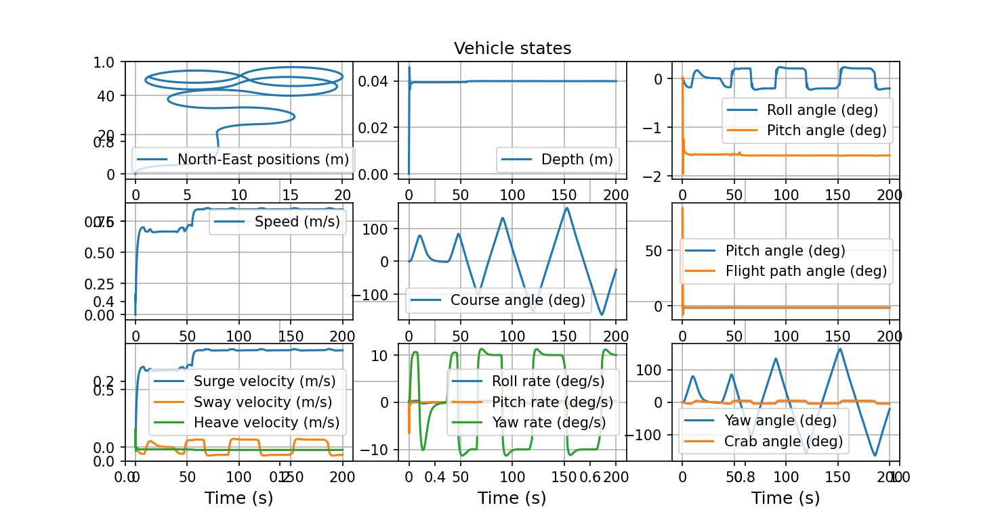
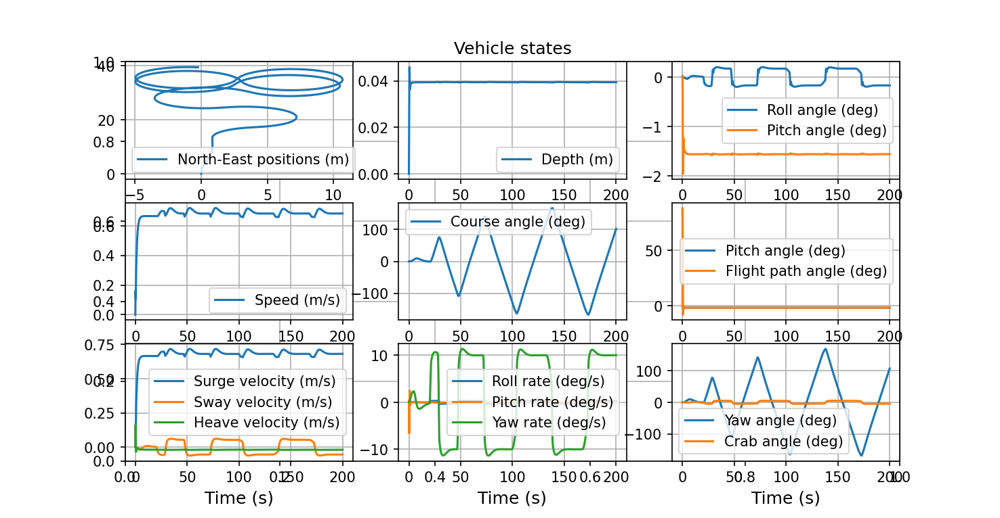

# USV Coverage Path Planning Based on CovPlan

## 项目简介
本项目基于开源库 **CovPlan** 和 **PythonVehicleSimulator**，完成了无人船（USV）覆盖路径规划与船模轨迹跟踪的初步联调。

项目实现了从以下流程的基本打通：

- 区域输入
- 覆盖路径生成
- 路径点导出
- 局部坐标转换
- Otter USV 跟踪仿真

---

## 项目目标
本项目的主要目标包括：

1. 复现 CovPlan 的基础覆盖路径规划功能  
2. 将规划结果转换为船模可用的局部 North-East 航点  
3. 在 PythonVehicleSimulator 中驱动 Otter USV 对路径进行跟踪  
4. 分析联调过程中的控制效果与存在问题  

---

## 方法流程

### 1. 覆盖路径规划
使用 CovPlan 对给定区域进行覆盖路径规划，输入为经纬度多边形边界文件。

### 2. 航点导出
将 CovPlan 输出的经纬度路径点转换为局部 North-East 坐标，并保存为 `covplan_waypoints.txt`。

### 3. 船模跟踪
在 PythonVehicleSimulator 中调用 Otter USV 模型，基于简单航向参考更新策略进行路径跟踪。

---

## CovPlan 导出航点图


上图展示了由 CovPlan 输出并转换后的局部航点，整体呈现折返式覆盖路径特征。

---

## Otter USV 跟踪结果


上图展示了 Otter USV 对 CovPlan 导出路径的第一版跟踪结果。

---

## 实验结果分析

实验展示，本项目已经成功完成了：

- CovPlan 覆盖路径生成
- 路径点导出与坐标转换
- Otter USV 船模读取航点并进行跟踪

同时也发现当前系统仍存在以下问题：

- 拐点附近存在明显振荡
- 航点较密时容易绕圈或过冲
- 当前基于简单航向参考更新的控制策略仍较粗糙

总体来看，当前系统已经验证了路径规划结果可用于船模跟踪仿真，但由于控制器仍采用较为简单的航向参考更新策略，因此在拐点和密集航点区域的跟踪性能仍有待提高。

因此，本项目可以认为已经完成了路径规划与船模仿真之间的初步闭环验证，但在控制性能上仍有进一步优化空间。

---

## 运行方式

### 1. 生成 CovPlan 航点
```bash
python export_covplan_waypoints.py
```

### 2. 查看航点图
```bash
python plot_waypoints.py
```

### 3. 运行 Otter 跟踪仿真
```bash
python main.py
```

运行后选择：

```text
3
```

即 `Otter unmanned surface vehicle (USV)`。

---

## 项目结构

```text
usv-path-planning/
├── covplan_area.txt
├── covplan_waypoints.txt
├── export_covplan_waypoints.py
├── plot_waypoints.py
├── covplan_waypoints_plot.png
├── otter_tracking_covplan_v1.png
└── README.md
```

---

## 当前结论

本项目已经成功完成 CovPlan 与 Otter USV 的第一版联调，实现了从覆盖路径规划到船模跟踪仿真的初步验证。

---

## 后续优化方向

- 使用 LOS guidance 或 Pure Pursuit 替代简单航向切换策略
- 对航点进行平滑处理，减少拐点振荡
- 引入障碍物场景与更复杂区域
- 比较不同路径规划算法与跟踪控制方法的效果

---
## 跟踪策略迭代与版本对比

### v1：基础联调版


v1 采用“当前航点—目标航向”直接更新策略，能够实现 CovPlan 路径与 Otter 船模之间的初步联通，但在拐点和局部密集航点区域存在明显振荡与绕行现象。

### v2：固定前视点升级版


v2 在 v1 的基础上引入固定前视点（look-ahead waypoint）思想，使无人船不再严格朝向当前航点，而是朝向前方若干个航点形成的参考方向进行跟踪。实验结果表明，v2 在部分转弯区域的轨迹连续性有所改善，但顶部折返区域仍存在较明显的过冲与绕行。

### v3：简化 LOS 升级版


v3 进一步采用基于前视距离的简化 LOS 引导方法，使前视目标的选取由固定索引改为根据当前位置动态确定。相比 v2，v3 的轨迹连续性进一步改善，顶部折返区域的绕行范围有所减小，说明动态前视目标的选取对轨迹平滑性具有一定积极作用。但在折返区域仍存在一定振荡现象，表明当前控制器仍需进一步优化。

---

## 版本对比总结

整体来看，项目已经完成了从 CovPlan 路径规划到 Otter 船模跟踪仿真的完整联调流程。随着 v1 基础联调版、v2 固定前视点版到 v3 简化 LOS 版的逐步优化，轨迹平滑性有所提升，但在折返区域仍存在明显的控制改进空间。

从实验结果可以看出：

- **v1** 主要完成了路径规划结果与船模跟踪之间的基础联通；
- **v2** 通过固定前视点方法，在一定程度上改善了转弯区域的轨迹平滑性；
- **v3** 通过基于前视距离的简化 LOS 引导策略，使路径跟踪过程中的轨迹连续性进一步提升，但整体控制性能仍有优化空间。
## 项目性质说明

本项目属于“开源项目复现 + 船模联调实验”的初步研究工作。  
重点在于完成路径规划与船模跟踪之间的联通，并分析联调过程中的问题与改进方向。
