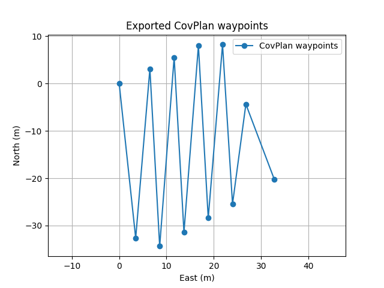
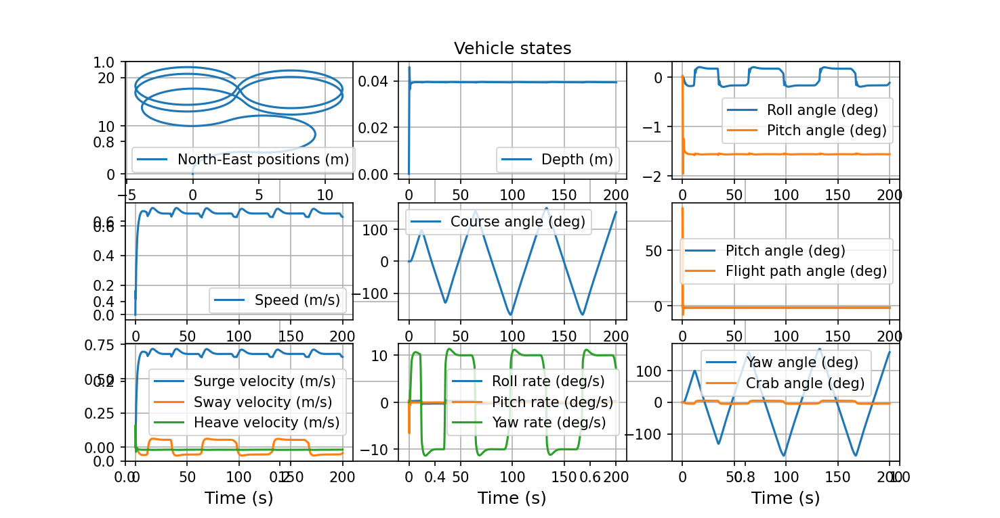

# USV Coverage Path Planning and Tracking Simulation

## 项目简介

本项目围绕无人船（USV）覆盖路径规划与船模轨迹跟踪展开，基于 **CovPlan** 与 **PythonVehicleSimulator** 完成了从区域覆盖路径规划、航点导出、坐标转换到 Otter USV 船模跟踪仿真的完整流程。

项目主要完成了以下工作：

1. 复现 CovPlan 覆盖路径规划流程；
2. 将 CovPlan 输出路径点转换为局部 North-East 坐标；
3. 将路径点接入 PythonVehicleSimulator 中的 Otter USV 模型；
4. 实现无人船对规划航点的初步跟踪仿真；
5. 尝试固定前视点、简化 LOS、航点平滑与航点稀疏化等小型优化；
6. 引入路径长度、平滑度、最大曲率变化、跟踪误差和能耗代理等评测指标；
7. 进一步引入真实湖泊边界 GeoJSON 数据，完成真实水域局部边界下的补充实验。

本项目属于“开源项目复现 + 路径规划与船模联调实验”的初步研究工作，重点在于打通路径规划与船模仿真之间的技术流程，并分析不同策略对跟踪效果的影响。

---

## 技术路线

项目整体流程如下：

```text
真实/规则区域边界
        ↓
CovPlan 覆盖路径规划
        ↓
路径点导出
        ↓
经纬度坐标 → 局部 North-East 坐标
        ↓
航点稀疏化 / 平滑处理
        ↓
Otter USV 船模读取航点
        ↓
PythonVehicleSimulator 跟踪仿真
        ↓
结果图与定量指标评估
```

---

## 项目结构

```text
usv-path-planning/
├── README.md
├── week1_progress.md
├── week2_progress.md
│
├── covplan_area.txt
├── covplan_area_real_small.txt
├── covplan_waypoints.txt
│
├── selected_lake.geojson
├── selected_lake_small.geojson
│
├── export_covplan_waypoints.py
├── geojson_to_covplan.py
├── plot_waypoints.py
├── evaluate_metrics.py
│── covplan_waypoints_real_sparse.png
│── otter_tracking_real_sparse.png
│── metrics_real_sparse.txt
│── covplan_waypoints_real_scaled.png
│── otter_tracking_real_scaled.png
```
## 核心代码说明

本项目主要代码由 4 个脚本组成，分别负责真实边界转换、CovPlan 航点导出、航点可视化和结果评测。

| 文件名 | 作用 |
|---|---|
| `geojson_to_covplan.py` | 将 QGIS 导出的真实湖泊边界 GeoJSON 文件转换为 CovPlan 可读取的 `txt` 边界文件 |
| `export_covplan_waypoints.py` | 调用 CovPlan 生成覆盖路径，并将经纬度路径点转换为局部 North-East 航点 |
| `plot_waypoints.py` | 绘制导出的 CovPlan 航点，用于检查路径形状和尺度是否合理 |
| `evaluate_metrics.py` | 读取参考航点和船模仿真轨迹，计算路径长度、平滑度、曲率变化、跟踪误差和能耗代理指标 |

---

## 代码运行流程

### 1. GeoJSON 边界转换

首先使用 QGIS 从真实湖泊数据中裁剪出局部水域边界，并导出为：

```text
selected_lake_small.geojson
```

然后运行：

```bash
python geojson_to_covplan.py
```

该脚本会生成：

```text
covplan_area_real_small.txt
```

该文件是 CovPlan 的输入区域边界文件，格式为：

```text
lat lon
lat lon
lat lon
...
NaN NaN
```

---

### 2. CovPlan 航点生成与坐标转换

运行：

```bash
python export_covplan_waypoints.py
```

该脚本完成以下工作：

1. 读取 `covplan_area_real_small.txt`；
2. 调用 CovPlan 生成覆盖路径；
3. 将经纬度路径点转换为局部 North-East 坐标；
4. 对真实区域进行尺度缩放；
5. 对航点进行稀疏化处理；
6. 保存最终船模可读取的航点文件。

输出文件为：

```text
covplan_waypoints.txt
```

其中核心处理逻辑包括：

```python
# 经纬度转局部 North-East 坐标
north = (op[:, 0] - lat0) * meters_per_deg_lat
east = (op[:, 1] - lon0) * meters_per_deg_lon

raw_ne = np.column_stack((north, east))

# 缩放到适合小尺度 USV 仿真的范围
scale = 0.01
raw_ne = raw_ne * scale
```

真实边界路径点较密，因此进一步进行航点稀疏化：

```python
def downsample_by_distance(wps, min_dist=12.0, max_points=12):
    if len(wps) < 2:
        return wps

    out = [wps[0]]
    last = wps[0]

    for p in wps[1:]:
        if np.linalg.norm(p - last) >= min_dist:
            out.append(p)
            last = p

    if not np.allclose(out[-1], wps[-1]):
        out.append(wps[-1])

    out = np.array(out)

    if len(out) > max_points:
        idx = np.linspace(0, len(out) - 1, max_points).astype(int)
        out = out[idx]

    return out
```

---

### 3. 航点可视化

运行：

```bash
python plot_waypoints.py
```

该脚本读取：

```text
covplan_waypoints.txt
```

并绘制二维航点图，用于检查：

- 航点是否生成成功；
- 路径尺度是否合理；
- 航点是否过密；
- 是否适合接入 Otter USV 船模。

---

### 4. Otter USV 船模跟踪

进入 PythonVehicleSimulator 主程序目录：

```bash
cd C:\Users\16222\Desktop\PythonVehicleSimulator-master\src\python_vehicle_simulator
python main.py
```

运行后输入：

```text
3
```

选择：

```text
Otter unmanned surface vehicle (USV)
```

船模主循环会读取 `covplan_waypoints.txt` 中的航点，并根据当前无人船位置更新参考航向，实现基础航点跟踪。

---

### 5. 评测指标计算

仿真结束后运行：

```bash
python C:\Users\16222\Desktop\usv-path-planning\evaluate_metrics.py
```

该脚本读取：

```text
covplan_waypoints.txt
simData_otter.csv
```

并计算以下指标：

| 指标 | 含义 |
|---|---|
| Reference path length | 参考路径长度 |
| Tracked path length | 实际跟踪轨迹长度 |
| Smoothness | 平滑度，基于转角平方和 |
| Max curvature change | 最大曲率变化 |
| Mean tracking error | 平均跟踪误差 |
| RMSE tracking error | 均方根跟踪误差 |
| Max tracking error | 最大跟踪误差 |
| Energy proxy | 简单能耗代理指标 |

其中跟踪误差通过实际轨迹点到参考航点的最近距离近似计算：

```python
tree = cKDTree(reference)
dist, _ = tree.query(trajectory)

mean_err = np.mean(dist)
rmse_err = np.sqrt(np.mean(dist ** 2))
max_err = np.max(dist)
```

---

## 关键代码逻辑总结

本项目代码的核心并不是单独实现一个复杂控制器，而是完成以下几个模块之间的联通：

```text
GeoJSON 真实边界
        ↓
CovPlan 输入格式
        ↓
CovPlan 覆盖路径
        ↓
局部 North-East 航点
        ↓
航点缩放与稀疏化
        ↓
Otter USV 船模跟踪
        ↓
定量指标评估
```

其中最关键的代码工作包括：

1. **真实边界数据格式转换**  
   将 GeoJSON 多边形外边界转换为 CovPlan 可读取的 `lat lon` 文本格式。

2. **坐标系统转换**  
   将经纬度路径点转换为局部 North-East 平面坐标，使其能够被船模仿真系统使用。

3. **航点后处理**  
   对真实边界生成的密集航点进行缩放和稀疏化，使其适配当前 Otter USV 小尺度仿真平台。

4. **船模主循环改造**  
   将默认固定航向控制改为基于导入航点的跟踪控制。

5. **结果量化评估**  
   通过路径长度、平滑度、曲率变化、跟踪误差和能耗代理等指标，对不同版本实验结果进行比较。
---

## 环境配置

建议使用 Conda 环境运行本项目。

```bash
conda activate usv
```

主要依赖包括：

```bash
pip install numpy scipy matplotlib covplan
```

本项目还使用了：

- CovPlan：用于覆盖路径规划；
- PythonVehicleSimulator：用于 Otter USV 船模仿真；
- QGIS：用于真实湖泊边界数据裁剪与导出；
- GeoJSON 数据：用于真实水域边界实验。

---

## 运行方式

### 1. 生成 CovPlan 航点

```bash
conda activate usv
cd C:\Users\16222\Desktop\usv-path-planning
python export_covplan_waypoints.py
```

运行后会生成：

```text
covplan_waypoints.txt
```

该文件保存了转换后的局部 North-East 航点。

---

### 2. 查看航点图

```bash
python plot_waypoints.py
```

该脚本用于查看 CovPlan 输出航点的二维分布情况。

---

### 3. 运行 Otter USV 跟踪仿真

进入 PythonVehicleSimulator 主程序目录：

```bash
cd C:\Users\16222\Desktop\PythonVehicleSimulator-master\src\python_vehicle_simulator
python main.py
```

运行后选择：

```text
3
```

即选择：

```text
Otter unmanned surface vehicle (USV)
```

仿真完成后会输出 Vehicle states 图，用于观察无人船轨迹、速度、姿态角和航向角等状态变化。

---

### 4. 运行评测指标

```bash
python C:\Users\16222\Desktop\usv-path-planning\evaluate_metrics.py
```

评测脚本会输出：

- Reference path length
- Tracked path length
- Smoothness
- Max curvature change
- Mean tracking error
- RMSE tracking error
- Max tracking error
- Energy proxy

同时会保存结果到：

```text
metrics_result.txt
```

---

## 规则区域基础实验

在基础实验中，首先使用规则测试区域验证 CovPlan 与 Otter USV 的联调流程。该部分主要目标是验证：

1. CovPlan 能够生成覆盖路径；
2. 路径点能够转换为局部 North-East 坐标；
3. Otter USV 能够读取航点并进行跟踪；
4. 船模仿真结果能够被保存和评估。

基础实验完成了从路径规划到船模仿真的第一版闭环验证。

---

## 跟踪策略迭代

### v1：基础联调版

v1 采用“当前航点—目标航向”直接更新策略。该方法能够实现 CovPlan 路径与 Otter 船模之间的初步联通，但在路径拐点和局部密集航点区域存在明显振荡、绕圈和过冲现象。

---

### v2：固定前视点升级版

v2 在 v1 的基础上引入固定前视点（look-ahead waypoint）思想，使无人船不再严格指向当前航点，而是朝向前方若干个航点形成的参考方向进行跟踪。

实验结果表明，固定前视点方法能够在一定程度上改善转弯区域的轨迹平滑性，但在折返区域仍存在较明显的过冲与绕行。

---

### v3：简化 LOS 升级版

v3 进一步采用基于前视距离的简化 LOS 引导方法，使前视目标的选取由固定索引改为根据当前位置动态确定。

实验结果表明，简化 LOS 方法能够进一步改善轨迹连续性，但由于当前控制框架仍然基于较简单的 headingAutopilot，折返区域的振荡问题并未完全消除。

---

### A1：航点平滑与稀疏化

A1 尝试对 CovPlan 导出的航点进行平滑和稀疏化处理，使路径更符合船舶运动特性。

实验发现，航点平滑能够改善轨迹连续性，但过度平滑可能削弱原始覆盖路径的折返几何特征。航点稀疏化则可以降低船模在短时间内频繁切换目标航点的压力，提高仿真实验的可执行性。

---

## 评测指标设计

为了避免仅依赖路径图进行主观判断，项目进一步加入了定量评测指标。

### 1. 路径长度

用于衡量参考路径和实际跟踪轨迹的长度差异。

```text
Reference path length
Tracked path length
```

若实际轨迹明显长于参考路径，通常说明存在绕行、过冲或反复修正。

---

### 2. 平滑度

使用转角平方和作为简单平滑度指标。数值越小，说明轨迹越平滑。

需要注意的是，平滑度较小并不一定意味着跟踪精度更高。船模轨迹可能因为动力学惯性而变得更圆滑，但同时偏离原始参考路径。

---

### 3. 最大曲率变化

用于衡量路径或轨迹在转弯处的剧烈程度。数值越大，说明路径中存在更强的急转弯或曲率变化。

---

### 4. 跟踪误差

使用轨迹点到参考航点的最近距离近似计算跟踪误差，包括：

```text
Mean tracking error
RMSE tracking error
Max tracking error
```

其中 RMSE 能够更明显地反映较大偏差点的影响。

---

### 5. 简单能耗代理指标

由于当前项目未建立真实推进功率模型，因此使用速度和偏航角速度构造简单能耗代理指标：

```text
Energy proxy
```

该指标主要用于不同版本之间的相对比较，不代表真实物理能耗。

---

## 规则区域实验结果示例

在一组规则区域实验中，A1 航点平滑版本得到如下结果：

| 指标 | 数值 |
|---|---:|
| Reference path length | 44.573 m |
| Tracked path length | 76.345 m |
| Reference smoothness | 4.896759 |
| Tracked smoothness | 0.062850 |
| Reference max curvature change | 0.188912 |
| Tracked max curvature change | 0.039841 |
| Mean tracking error | 2.800 m |
| RMSE tracking error | 3.190 m |
| Max tracking error | 6.688 m |
| Energy proxy | 34.085868 |

该结果说明，船模实际轨迹比参考路径更长，存在一定绕行与修正动作。同时，实际轨迹的平滑度指标小于参考路径，说明船模由于动力学特性和惯性作用，其运动轨迹被“走圆了”。这并不代表跟踪更准确，而是说明在轨迹平滑性与几何保持能力之间存在权衡。

---

## 真实湖泊边界补充实验

为增强项目的实际场景意义，进一步引入公开 GeoJSON 水体边界数据作为真实水域输入。

实验流程如下：

1. 从公开 GeoJSON 水体数据中选取湖泊边界；
2. 使用 QGIS 选取单个湖泊并进行局部裁剪；
3. 将裁剪后的湖泊边界导出为 GeoJSON 文件；
4. 使用 `geojson_to_covplan.py` 将 GeoJSON 边界转换为 CovPlan 输入格式；
5. 使用 CovPlan 生成覆盖路径；
6. 将路径点转换为局部 North-East 坐标；
7. 对路径进行尺度缩放与航点稀疏化；
8. 将处理后的航点接入 Otter USV 船模；
9. 使用评测指标分析真实边界场景下的跟踪效果。

---

## 真实边界航点结果



上图为真实湖泊局部边界经过裁剪、缩放和航点稀疏化后生成的 CovPlan 航点结果。该路径保留了真实水域局部边界的非规则几何特征，同时将航点数量控制在适合船模跟踪的范围内。

---

## 真实边界 Otter 跟踪结果



上图为 Otter USV 对真实湖泊局部边界航点的跟踪仿真结果。可以看出，船模能够根据真实数据生成的航点进行连续运动，说明真实边界数据已经成功接入“覆盖路径规划—船模跟踪仿真”流程。

不过，由于真实边界路径存在较多折返和急转弯，当前基于 headingAutopilot 的简单跟踪策略仍会出现回环、过冲和转弯振荡现象。

---

## 真实数据实验指标对比

### 真实边界初始版本

| 指标 | 数值 |
|---|---:|
| Reference path length | 1841.646 m |
| Tracked path length | 136.903 m |
| Mean tracking error | 21.574 m |
| RMSE tracking error | 22.657 m |
| Max tracking error | 30.437 m |
| Energy proxy | 96.452888 |

该版本说明真实边界数据能够接入流程，但参考路径长度过大，明显超出了 200 s 仿真时间内船模可完成的航程。

---

### 真实边界缩放版本

| 指标 | 数值 |
|---|---:|
| Reference path length | 1159.058 m |
| Tracked path length | 136.922 m |
| Mean tracking error | 17.165 m |
| RMSE tracking error | 18.245 m |
| Max tracking error | 26.628 m |
| Energy proxy | 96.478823 |

经过局部裁剪和尺度缩放后，真实数据实验的误差有所下降，但参考路径仍然明显长于 200 s 内船模可完成的距离。

---

### 真实边界稀疏化版本

| 指标 | 数值 |
|---|---:|
| Reference path length | 368.193 m |
| Tracked path length | 136.744 m |
| Reference smoothness | 87.615571 |
| Tracked smoothness | 0.117057 |
| Reference max curvature change | 0.030999 |
| Tracked max curvature change | 0.011158 |
| Mean tracking error | 12.318 m |
| RMSE tracking error | 13.284 m |
| Max tracking error | 20.565 m |
| Energy proxy | 96.220930 |

与前一版本相比，航点稀疏化后：

- 参考路径长度由 1159.058 m 降低至 368.193 m；
- 平均跟踪误差由 17.165 m 降低至 12.318 m；
- RMSE 由 18.245 m 降低至 13.284 m；
- 最大跟踪误差由 26.628 m 降低至 20.565 m。

结果表明，航点稀疏化能够提升真实边界场景下路径跟踪实验的可执行性。

---

## 真实数据实验结论

真实湖泊边界补充实验表明，本项目已经能够将真实水域边界数据接入 CovPlan-Otter 联调流程，完成从真实边界提取、局部裁剪、尺度缩放、航点稀疏化到船模跟踪仿真的完整流程。

同时，实验也表明，真实边界场景下的路径跟踪难度明显高于规则区域实验。真实水域边界具有非规则几何特征，CovPlan 生成的覆盖路径往往包含较多折返段和急转弯，对当前简单航点跟踪控制策略提出了更高要求。

航点稀疏化能够有效降低参考路径长度和跟踪误差，但由于当前仿真时间为 200 s，实际航迹长度仍小于参考路径长度，因此系统尚未实现完整高精度覆盖跟踪。后续需要进一步优化航点密度、仿真时长和引导控制策略。

---

## 项目主要成果

本项目已经完成以下成果：

1. 成功复现 CovPlan 覆盖路径规划流程；
2. 实现 CovPlan 输出路径点到局部 North-East 坐标的转换；
3. 将路径点接入 PythonVehicleSimulator 中的 Otter USV 模型；
4. 实现从路径规划到船模跟踪仿真的初步闭环；
5. 尝试固定前视点、简化 LOS、参考航向变化率限制、航点平滑与稀疏化等小型优化；
6. 构建路径长度、平滑度、曲率变化、跟踪误差和能耗代理等评测指标；
7. 引入真实湖泊边界 GeoJSON 数据，完成真实水域局部场景实验；
8. 对不同实验版本的优缺点进行了定量与定性分析。

---

## 当前不足

项目当前仍存在以下不足：

1. 当前 Otter 跟踪控制策略仍较简单，主要基于 headingAutopilot 和航点切换逻辑；
2. 在路径折返和急转弯区域仍存在绕行、过冲和振荡现象；
3. 真实边界实验中参考路径仍较长，200 s 仿真时间不足以完成完整路径跟踪；
4. 当前能耗指标仅为代理指标，并不代表真实推进系统能耗；
5. 当前尚未引入真实海流、动态障碍物和复杂环境约束。

---

## 后续优化方向

后续可以从以下几个方向继续改进：

1. 引入更规范的 LOS guidance 或 Pure Pursuit 引导方法；
2. 对 CovPlan 输出路径进行更合理的航点平滑与曲率约束处理；
3. 加入船舶最小转弯半径或最大航向变化率约束；
4. 进一步优化航点稀疏化策略，使其兼顾覆盖完整性与可跟踪性；
5. 加入固定方向海流、高风险区或移动障碍物等环境因素；
6. 增加不同算法或不同参数下的对比实验；
7. 将能耗代理指标进一步扩展为更接近真实推进功率的估计模型。

---

## 项目总结

本项目完成了从覆盖路径规划到无人船船模跟踪仿真的完整流程验证。首先基于 CovPlan 实现二维区域覆盖路径规划，并将输出路径点转换为 Otter USV 船模可读取的局部 North-East 坐标；随后在 PythonVehicleSimulator 中修改航点跟踪逻辑，实现路径规划结果与船模仿真的初步联调。

在基础联调的基础上，项目进一步尝试了固定前视点、简化 LOS 引导、参考航向变化率限制和航点平滑等小型优化方法，并通过路径长度、平滑度、曲率变化、跟踪误差和能耗代理等指标进行评估。实验结果表明，前视点和航点稀疏化能够在一定程度上提升轨迹连续性和实验可执行性，但在折返区域仍存在绕行与过冲现象。

此外，项目还引入真实湖泊边界 GeoJSON 数据，完成了从真实边界提取、局部裁剪、尺度缩放、航点稀疏化到 Otter 跟踪仿真的补充实验。该部分验证了系统对真实几何边界输入的适应能力，也暴露出复杂路径下控制器精度不足的问题。

总体来看，本项目属于“开源项目复现 + 路径规划与船模联调实验”的初步研究工作，已经形成了较完整的技术闭环。后续可进一步引入更规范的 LOS guidance、Pure Pursuit、路径平滑和动态环境因素，以提升无人船在复杂真实场景下的路径跟踪性能。
