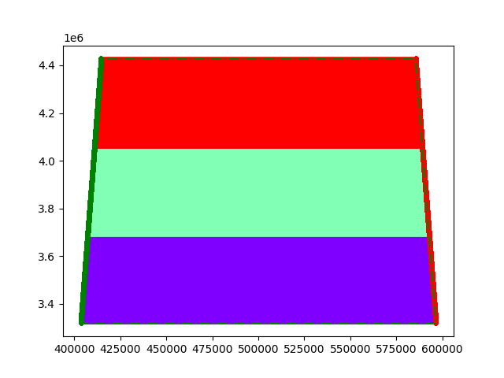

# USV Path Planning (CovPlan)

This project implements a simple coverage path planning for unmanned surface vehicles (USV).

## Method
- Input: polygon area (area.txt)
- Output: coverage path

## Result

## How to run
python test_covplan.py