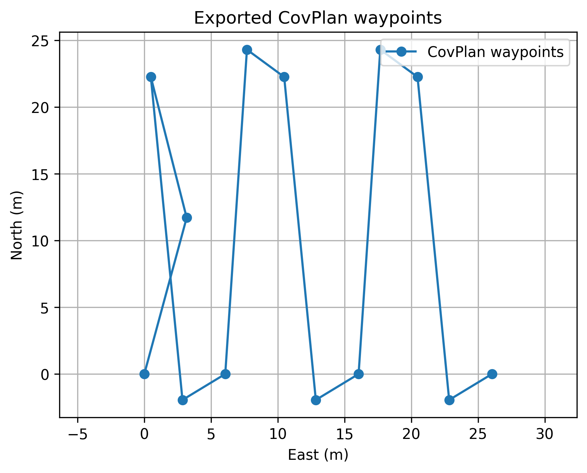
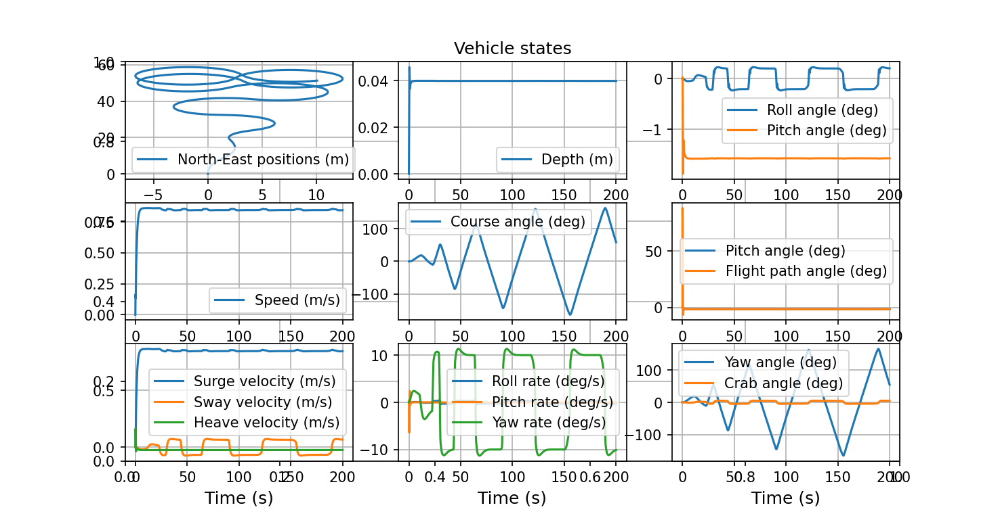

# Week 2 Progress: Otter Waypoint Tracking and Initial Integration

## 本周目标
本周的主要目标是在完成 CovPlan 基础复现的基础上，进一步接入 PythonVehicleSimulator 中的 Otter USV 模型，尝试实现从路径点输入到船模轨迹跟踪的初步联调。

---

## 本周完成内容

### 1. PythonVehicleSimulator 环境搭建与默认案例运行
成功安装并运行了 PythonVehicleSimulator，能够正常调用 `main.py` 并选择 `Otter unmanned surface vehicle (USV)` 进行仿真。  
默认案例下，系统能够正常输出状态图，说明 Otter 模型、仿真主循环与自动驾驶器均可正常工作。

### 2. 仿真主流程分析
对项目中的关键模块进行了初步梳理，主要包括：
- `main.py`：菜单入口与船模选择
- `lib/mainLoop.py`：主仿真循环
- `vehicles/otter.py`：Otter 模型、控制模式与 `headingAutopilot` 方法

通过阅读这些代码，确认了默认 Otter 案例使用的是固定航向控制模式，即通过 `headingAutopilot` 对目标航向进行跟踪。

### 3. 手写航点跟踪实验
在 `mainLoop.py` 中加入了简单的航点切换逻辑，使用手写的 North-East 航点替代默认固定航向输入，实现了 Otter 对航点序列的初步跟踪。

实验结果表明：
- 系统已经能够从“固定航向仿真”转变为“手写航点跟踪”
- 在轨迹图中可以观察到明显的转向和航点切换行为
- 说明基于当前船模与控制框架实现航点跟踪是可行的

### 4. 跟踪参数初步调整
为降低绕圈和振荡现象，对以下内容进行了初步调整：
- 降低推进推力
- 增大航点切换阈值
- 适当拉开航点间距
- 在终点附近引入简单减速逻辑

经过调整后，轨迹较初版有所改善，说明参数调整对跟踪性能具有明显影响。

### 5. CovPlan 与 Otter 初步联调
在完成手写航点测试后，将 CovPlan 输出的路径点进一步导出为局部 North-East 坐标，并保存为 `covplan_waypoints.txt`。  
随后修改主循环，使 Otter 模型能够从文件中读取航点并进行跟踪仿真，成功实现了：

- CovPlan 路径规划输出
- 路径点导出与坐标转换
- Otter 船模航点读取
- 路径跟踪仿真

即完成了覆盖路径规划与船模跟踪的第一版联调。

---
## CovPlan 导出航点图



上图展示了由 CovPlan 输出并转换后的局部航点，整体呈现折返式覆盖路径特征。

---

## Otter USV 跟踪结果



上图展示了 Otter USV 对 CovPlan 导出路径的第一版跟踪结果。

## 本周主要问题

### 1. 跟踪控制较为粗糙
当前方法本质上仍属于“当前航点直接转向”的简单策略，因此在以下情况下表现不够理想：
- 拐点附近容易振荡
- 航点较密时容易绕圈
- 部分区域会出现明显过冲

### 2. CovPlan 输出点需要额外处理
CovPlan 原始输出为经纬度路径点，不能直接输入船模，需要额外完成：
- 局部坐标转换
- 重复点剔除
- 抽样与稀疏化

这一过程本身也会影响最终跟踪效果。

### 3. 联调成功但效果仍需优化
虽然已经实现了路径规划与船模之间的联通，但当前控制性能仍然有限，因此这一步更适合定义为“初步联调成功”，而不是“高质量轨迹跟踪完成”。

---

## 本周阶段性结论
本周已经成功完成了 PythonVehicleSimulator 中 Otter 模型的调用与初步航点跟踪实验，并在此基础上实现了 CovPlan 路径规划结果与船模仿真之间的第一版联调。

实验结果表明，系统已经具备从覆盖路径规划到船模跟踪的基本闭环能力。但与此同时，当前跟踪控制方法仍较为简单，在转弯和密集航点区域存在较明显的振荡与绕行现象，说明后续仍需在引导与控制策略上进一步优化。

---

## 下一步计划
下一步拟从以下方向继续改进：

1. 尝试使用 LOS guidance 或 Pure Pursuit 等更稳定的引导方法  
2. 对 CovPlan 导出的航点进行平滑与进一步稀疏化处理  
3. 对比不同抽样步长下的跟踪效果
 ## 运行方式

### 1. 生成 CovPlan 航点
```bash
python export_covplan_waypoints.py
```

### 2. 查看航点图
```bash
python plot_waypoints.py
```

### 3. 运行 Otter 跟踪仿真
```bash
python main.py
```

运行后选择：

```text
3
```

即 `Otter unmanned surface vehicle (USV)`。
  

